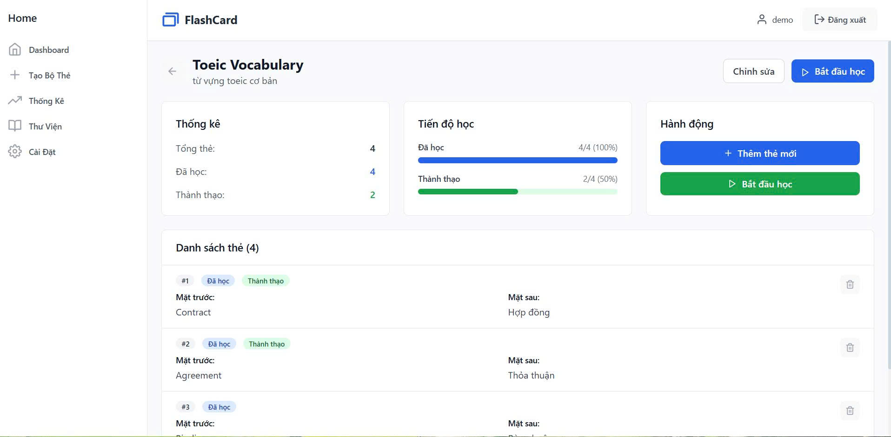

# FlashCard App

Ứng dụng học tập thông minh sử dụng thẻ ghi nhớ (flashcards) được xây dựng với React + Vite, hỗ trợ offline và theo dõi tiến độ học tập. Ứng dụng cung cấp trải nghiệm học tập hiệu quả với giao diện thân thiện và hệ thống lặp lại ngắt quãng (SRS).

## Tính năng chính

### Xác thực người dùng
- **Đăng nhập/Đăng ký**: Hệ thống xác thực demo với validation đầy đủ
- **Quản lý phiên**: Tự động lưu trạng thái đăng nhập
- **Bảo mật form**: Validation email, mật khẩu với các yêu cầu bảo mật

### Quản lý bộ thẻ học
- **Tạo bộ thẻ mới**: Tạo bộ thẻ với tên, mô tả và thêm nhiều thẻ cùng lúc
- **Chỉnh sửa bộ thẻ**: Cập nhật thông tin bộ thẻ và quản lý từng thẻ
- **Xóa bộ thẻ**: Loại bỏ bộ thẻ không cần thiết với xác nhận
- **Phân loại**: Sắp xếp thẻ theo chủ đề, môn học, ngôn ngữ

### Học và ôn tập thông minh
- **Chế độ lật thẻ**: Xem mặt trước → suy nghĩ → lật để kiểm tra đáp án
- **Chế độ trắc nghiệm**: Kiểm tra kiến thức với câu hỏi 4 lựa chọn (A, B, C, D)
  - Tự động tạo các lựa chọn sai từ thẻ khác trong bộ
  - Hiển thị kết quả ngay lập tức với màu sắc trực quan
  - Hiệu ứng animation khi trả lời đúng/sai
- **Hệ thống SRS**: Lặp lại ngắt quãng tự động điều chỉnh theo độ khó
- **Đánh giá học tập**: Phân loại thẻ theo mức độ (Đang học/Đã biết)
- **Theo dõi tiến độ**: Thanh tiến độ hiển thị quá trình học trong phiên

### Thống kê và theo dõi
- **Dashboard tổng quan**: Hiển thị tổng số bộ thẻ, thẻ đã học, tiến độ học tập
- **Thống kê chi tiết**: Số thẻ đã học, đã thành thạo cho từng bộ
- **Biểu đồ tiến bộ**: Thanh tiến độ trực quan cho từng bộ thẻ
- **Phiên học**: Thống kê chi tiết cho mỗi phiên học tập

### Lưu trữ và đồng bộ
- **localStorage**: Lưu trữ dữ liệu local an toàn
- **Tự động lưu**: Dữ liệu được lưu ngay lập tức khi thay đổi
- **Khôi phục dữ liệu**: Tự động khôi phục khi mở lại ứng dụng

## Công nghệ sử dụng

- **Frontend**: React 18 + Vite 
- **Styling**: Tailwind CSS 
- **Routing**: React Router DOM v6
- **Icons**: React Icons 
- **Storage**: localStorage API
- **Build Tool**: Vite 

## Giao diện ứng dụng

### Màn hình đăng nhập

**Tính năng chính:**
- Form đăng nhập với validation đầy đủ
- Hiển thị/ẩn mật khẩu với icon eye
- Demo account sẵn có: `demo@flashcard.com`
- Giao diện clean với logo FlashCard
- Chuyển hướng tự động sau đăng nhập thành công
- Link đăng ký tài khoản mới

### Dashboard - Trang chủ

**Tính năng chính:**
- **Thống kê tổng quan**: 4 cards hiển thị metrics quan trọng
  - Tổng số bộ thẻ
  - Tổng số thẻ 
  - Tiến độ học 
  - Thành thạo 
- **Sidebar navigation**: Menu điều hướng với các trang chính
- **Danh sách bộ thẻ**: Hiển thị bộ thẻ với thông tin chi tiết
  - Tên: "Toeic Vocabulary"
  - Số thẻ và thời gian tạo
  - Mô tả ngắn gọn
- **Action buttons**: "Xem chi tiết" và "Học ngay"

### Tạo bộ thẻ mới

**Tính năng chính:**
- **Thông tin bộ thẻ**: Form nhập tên và mô tả
- **Quản lý thẻ học**: Giao diện thêm thẻ động
  - Mặt trước (Câu hỏi/Từ vựng)
  - Mặt sau (Câu trả lời/Nghĩa)
  - Placeholder text hướng dẫn
- **Nút thêm thẻ**: Mở rộng danh sách thẻ dễ dàng
- **Breadcrumb navigation**: Điều hướng rõ ràng

### Chỉnh sửa bộ thẻ

**Tính năng chính:**
- **Cập nhật thông tin**: Chỉnh sửa tên và mô tả bộ thẻ
- **Quản lý thẻ học nâng cao**:
  - Hiển thị trạng thái thẻ với badge màu
  - "Đã lưu" (badge xanh lá)
  - Chỉnh sửa nội dung trực tiếp
  - Icon xóa thẻ (trash icon)
- **Nút thêm thẻ**: Mở rộng bộ thẻ
- **Auto-save**: Lưu thay đổi tự động

### Chi tiết bộ thẻ

**Tính năng chính:**
- **Header thông tin**: Tên bộ thẻ và mô tả
- **Thống kê chi tiết**:
  - Tổng thẻ: 
  - Đã học:với progress bar xanh dương
  - Thành thạo: với progress bar xanh lá
- **Danh sách thẻ**:
  - Hiển thị từng thẻ với số thứ tự
  - Badge trạng thái: "Đã học", "Thành thạo"
  - Preview nội dung mặt trước và mặt sau
  - Icon xóa cho từng thẻ
- **Action buttons**: "Thêm thẻ mới" và "Bắt đầu học"
- **Chỉnh sửa**: Nút "Chỉnh sửa" ở góc phải

### Màn hình học tập


**Tính năng chính:**
- **Progress tracking**: "Thẻ 1/1" và thanh tiến độ 100%
- **Study modes**:
  - **"Lật thẻ"**: Chế độ học truyền thống
  - **"Trắc nghiệm"**: Chế độ quiz với 4 lựa chọn A, B, C, D
- **Flashcard interface**:
  - Hiển thị nội dung câu hỏi
  - Nút "Nhấn để lật lại" với icon refresh
- **Quiz interface**:
  - Hiển thị câu hỏi với 4 lựa chọn (A, B, C, D)
  - Feedback màu sắc: xanh (đúng), đỏ (sai)
  - Animation khi trả lời
  - Tự động chuyển câu sau 1.5 giây
- **Đánh giá học tập**:
  - "Đang học" (nút đỏ) - cần ôn lại
  - "Đã biết" (nút xanh) - đã thuộc
- **Thống kê phiên học**: Hiển thị số liệu realtime
  - Đã học, Đúng, Sai, Độ chính xác (%)
- **Navigation**: Nút back và close (X)

### Màn hình hoàn thành


## Cài đặt và chạy

### Yêu cầu hệ thống
- Node.js 16+ 
- npm hoặc yarn

### Cài đặt
```bash
# Clone repository
git clone <repository-url>
cd flash-card

# Cài đặt dependencies
npm install

# Chạy development server
npm run dev

# Build for production
npm run build

# Preview production build
npm run preview
```

##  Hướng dẫn sử dụng

### 1. Đăng ký/Đăng nhập
- Truy cập trang đăng nhập
- Tạo tài khoản mới hoặc đăng nhập

### 2. Tạo bộ thẻ đầu tiên
- Click "Tạo bộ thẻ mới" trên Dashboard
- Nhập tên và mô tả bộ thẻ
- Thêm các thẻ học với mặt trước và mặt sau

### 3. Bắt đầu học
- Chọn bộ thẻ từ Dashboard
- Click "Bắt đầu học"
- Chọn chế độ học:
  - **Lật thẻ**: Xem câu hỏi → suy nghĩ → lật thẻ → đánh giá
  - **Trắc nghiệm**: Chọn đáp án từ 4 lựa chọn A, B, C, D

### 4. Sử dụng chế độ trắc nghiệm 
- Yêu cầu: Bộ thẻ cần có ít nhất 4 thẻ với câu trả lời khác nhau
- Click "Trắc nghiệm" để chuyển chế độ
- Chọn đáp án A, B, C, hoặc D
- Nhận feedback ngay lập tức (xanh = đúng, đỏ = sai)
- Tự động chuyển câu tiếp theo sau 1.5 giây

### 5. Theo dõi tiến độ
- Xem thống kê trên Dashboard
- Theo dõi số thẻ đã học/thành thạo
- Kiểm tra độ chính xác trong chế độ trắc nghiệm

## Tác giả

- **Developer**: Truong Ngoc Khanh Linh
- **Contact**: <klinhtruong04@gmail.com>
- **GitHub**: [PWA-Flashcard](https://github.com/klitn/PWA-Flashcard)


